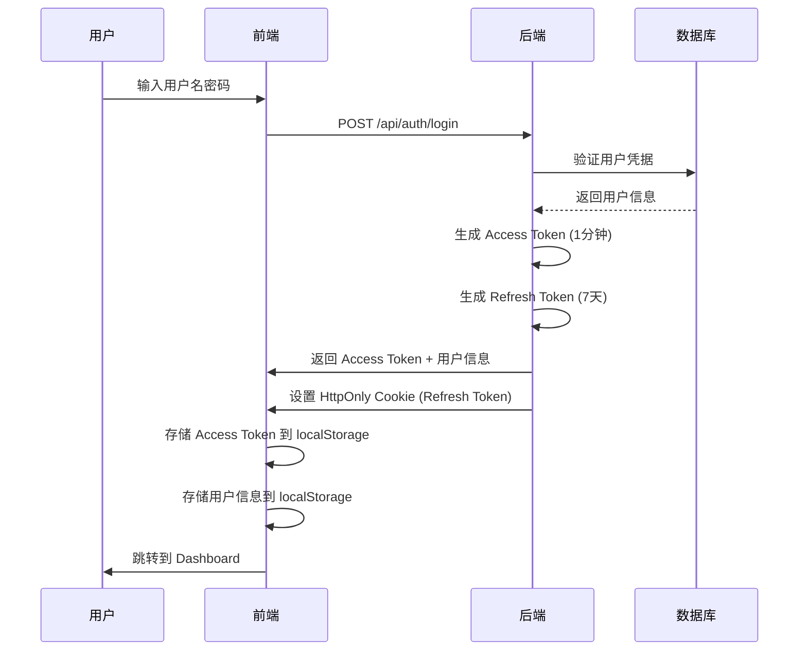
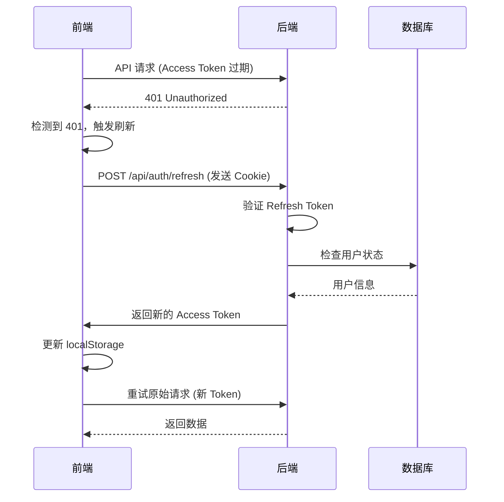
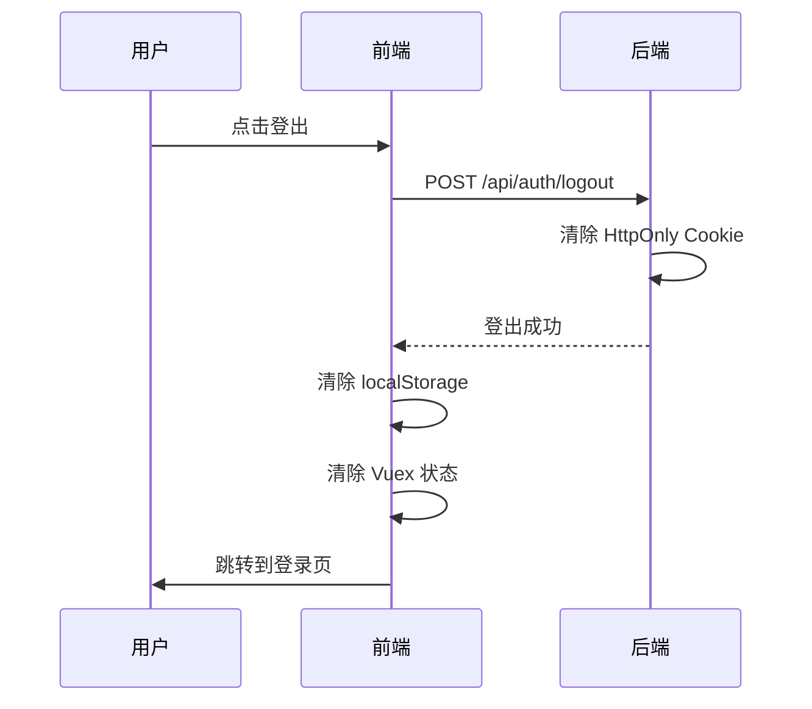

# JWT 认证实现总结

本文档详细分析了项目前后端的 JWT 认证实现，包括认证流程、Token 管理、刷新机制等核心原理。

## 📁 相关文件位置

### 后端文件
- **`modeltrain/backend/app/utils/auth.py`** - JWT 核心实现（Token 生成、验证、用户认证）
- **`modeltrain/backend/app/api/auth.py`** - 认证 API 路由（登录、注册、刷新、登出）
- **`modeltrain/backend/app/schemas/user.py`** - 用户相关的 Pydantic 模型
- **`modeltrain/backend/app/models/user.py`** - 用户数据库模型
- **`modeltrain/backend/requirements.txt`** - 依赖包配置

### 前端文件
- **`modeltrain/frontend/src/utils/tokenManager.js`** - Token 管理核心逻辑
- **`modeltrain/frontend/src/utils/api.js`** - Axios 拦截器和 API 封装
- **`modeltrain/frontend/src/router/index.js`** - 路由守卫实现
- **`modeltrain/frontend/src/store/index.js`** - 用户状态管理
- **`modeltrain/frontend/vite.config.js`** - 代理配置

### 配置文件
- **`modeltrain/backend/.env`** - 环境变量配置（需要创建）
- **`modeltrain/backend/main.py`** - FastAPI 应用入口和 CORS 配置

## 📋 目录
- [整体架构](#整体架构)
- [后端实现](#后端实现)
- [前端实现](#前端实现)
- [认证流程](#认证流程)
- [Token 刷新机制](#token-刷新机制)
- [安全特性](#安全特性)
- [关键配置](#关键配置)
- [⚠️ 发现的问题与修复建议](#️-发现的问题与修复建议)

---

## 整体架构

### 🔐 双 Token 架构
项目采用 **Access Token + Refresh Token** 的双令牌架构：

- **Access Token（访问令牌）**
  - 有效期：1分钟（开发环境，生产环境建议15分钟）
  - 存储位置：前端 localStorage
  - 用途：API 请求认证
  - 特点：短期有效，频繁刷新

- **Refresh Token（刷新令牌）**
  - 有效期：7天
  - 存储位置：HttpOnly Cookie
  - 用途：刷新 Access Token
  - 特点：长期有效，安全存储

### 🏗️ 架构优势
1. **安全性**：Refresh Token 存储在 HttpOnly Cookie 中，防止 XSS 攻击
2. **用户体验**：Access Token 短期有效，减少安全风险
3. **自动续期**：前端自动处理 Token 刷新，用户无感知
4. **跨域支持**：通过代理和 CORS 配置支持跨域认证

---

## 后端实现

### 🔧 核心配置（`app/utils/auth.py`）

```python
# JWT 配置
SECRET_KEY = "zsj-sb"  # 密钥（生产环境应使用环境变量）
ALGORITHM = "HS256"    # 加密算法
ACCESS_TOKEN_EXPIRE_MINUTES = 1   # Access Token 1分钟过期
REFRESH_TOKEN_EXPIRE_DAYS = 7     # Refresh Token 7天过期
```

### 🎫 Token 生成

#### Access Token 生成
```python
def create_access_token(data: dict, expires_delta: Optional[timedelta] = None):
    to_encode = data.copy()  # 复制用户信息
    if expires_delta:
        expire = datetime.utcnow() + expires_delta
    else:
        expire = datetime.utcnow() + timedelta(minutes=ACCESS_TOKEN_EXPIRE_MINUTES)
    
    to_encode.update({"exp": expire})  # 添加过期时间
    encoded_jwt = jwt.encode(to_encode, SECRET_KEY, algorithm=ALGORITHM)
    return encoded_jwt
```

#### Refresh Token 生成
```python
def create_refresh_token(data: dict, expires_delta: Optional[timedelta] = None):
    to_encode = data.copy()
    if expires_delta:
        expire = datetime.utcnow() + expires_delta
    else:
        expire = datetime.utcnow() + timedelta(days=REFRESH_TOKEN_EXPIRE_DAYS)
    
    to_encode.update({"exp": expire, "type": "refresh"})  # 添加类型标识
    encoded_jwt = jwt.encode(to_encode, SECRET_KEY, algorithm=ALGORITHM)
    return encoded_jwt
```

### 🔍 Token 验证

#### Access Token 验证
```python
def verify_token(token: str) -> Optional[dict]:
    try:
        payload = jwt.decode(token, SECRET_KEY, algorithms=[ALGORITHM])
        return payload
    except jwt.ExpiredSignatureError:
        return None  # Token 已过期
    except jwt.InvalidTokenError:
        return None  # Token 无效
```

#### Refresh Token 验证
```python
def verify_refresh_token(token: str) -> Optional[dict]:
    try:
        payload = jwt.decode(token, SECRET_KEY, algorithms=[ALGORITHM])
        if payload.get("type") != "refresh":  # 检查类型
            return None
        return payload
    except jwt.ExpiredSignatureError:
        return None
    except jwt.InvalidTokenError:
        return None
```

### 🛡️ 用户认证中间件

```python
def get_current_user(credentials: HTTPAuthorizationCredentials = Depends(security), db: Session = Depends(get_db)):
    token = credentials.credentials
    payload = verify_token(token)
    
    if payload is None:
        raise HTTPException(status_code=401, detail="通行证无效或已过期")
    
    user_id = payload.get("sub")
    user = db.query(User).filter(User.id == int(user_id)).first()
    
    if not user or not user.is_active:
        raise HTTPException(status_code=401, detail="用户不存在或已被禁用")
    
    return user
```

### 🔄 登录流程（`app/api/auth.py`）

```python
@router.post("/login")
async def login(user_data: UserLogin, response: Response, db: Session = Depends(get_db)):
    # 1. 验证用户凭据
    user = authenticate_user(db, user_data.login, user_data.password)
    
    # 2. 生成双 Token
    access_token = create_access_token(data={"sub": str(user.id)})
    refresh_token = create_refresh_token(data={"sub": str(user.id)})
    
    # 3. 设置 HttpOnly Cookie
    response.set_cookie(
        key="refresh_token",
        value=refresh_token,
        httponly=True,      # 防止 XSS
        secure=False,       # 开发环境
        samesite="lax",     # 跨域支持
        max_age=7 * 24 * 60 * 60,  # 7天
        path="/"
    )
    
    return LoginResponse(
        user=user,
        message="登录成功",
        access_token=access_token,
        refresh_token=None  # 不返回 Refresh Token
    )
```

### 🔄 Token 刷新流程

```python
@router.post("/refresh")
async def refresh_token(refresh_token: str = Cookie(None, alias="refresh_token"), db: Session = Depends(get_db)):
    # 1. 验证 Refresh Token
    payload = verify_refresh_token(refresh_token)
    if payload is None:
        raise HTTPException(status_code=401, detail="刷新令牌无效或已过期")
    
    # 2. 检查用户状态
    user_id = payload.get("sub")
    user = db.query(User).filter(User.id == int(user_id)).first()
    
    if not user or not user.is_active:
        raise HTTPException(status_code=401, detail="用户不存在或已被禁用")
    
    # 3. 生成新的 Access Token
    new_access_token = create_access_token(data={"sub": str(user.id)})
    
    return {"access_token": new_access_token, "token_type": "bearer"}
```

---

## 前端实现

### 🎯 Token 管理器（`src/utils/tokenManager.js`）

#### 核心状态管理
```javascript
// 全局状态
let isRefreshing = false        // 是否正在刷新
let failedQueue = []           // 失败请求队列
let hasAttemptedRefresh = false // 是否已尝试刷新
```

#### Token 获取与刷新
```javascript
export async function getAccessToken() {
    let token = localStorage.getItem('token')
    
    // 如果 Token 不存在或无效，尝试刷新
    if (!token || token === 'null' || token === 'undefined') {
        if (hasAttemptedRefresh) {
            throw new Error('Token刷新失败，请重新登录')
        }
        
        if (isRefreshing) {
            // 加入等待队列
            return new Promise((resolve, reject) => {
                failedQueue.push({ resolve, reject })
            })
        }
        
        isRefreshing = true
        try {
            token = await refreshToken()
            processQueue(null, token)  // 处理等待队列
            return token
        } catch (refreshError) {
            processQueue(refreshError, null)
            throw refreshError
        } finally {
            isRefreshing = false
        }
    }
    
    return token
}
```

#### 刷新 Token 实现
```javascript
const refreshToken = async () => {
    const response = await axios.post('/api/auth/refresh', {}, {
        withCredentials: true  // 发送 Cookie
    })
    
    const { access_token } = response.data
    localStorage.setItem('token', access_token)
    hasAttemptedRefresh = false
    return access_token
}
```

### 🔄 请求拦截器（`src/utils/api.js`）

#### 请求拦截
```javascript
api.interceptors.request.use(async config => {
    config.withCredentials = true
    
    // 跳过认证请求
    const isAuthRequest = config.url?.includes('/auth/login') || 
                         config.url?.includes('/auth/register') ||
                         config.url?.includes('/auth/refresh')
    
    if (!isAuthRequest) {
        try {
            const token = await getAccessToken()
            config.headers.Authorization = `Bearer ${token}`
        } catch (error) {
            if (error.message === 'Token刷新失败，请重新登录') {
                throw error
            }
        }
    }
    
    return config
})
```

#### 响应拦截
```javascript
api.interceptors.response.use(
    response => response,
    async error => {
        const originalRequest = error.config
        
        // 处理 401 错误
        if (error.response?.status === 401 && !originalRequest._retry) {
            try {
                const newToken = await handle401Error(originalRequest)
                originalRequest.headers.Authorization = `Bearer ${newToken}`
                originalRequest._retry = true
                return api(originalRequest)  // 重试请求
            } catch (refreshError) {
                return Promise.reject(refreshError)
            }
        }
        
        return Promise.reject(error)
    }
)
```

### 🛡️ 路由守卫（`src/router/index.js`）

```javascript
router.beforeEach((to, from, next) => {
    const userStr = localStorage.getItem('user')
    const token = localStorage.getItem('token')
    const hasValidAuth = token && userStr && userStr !== 'undefined' && token !== 'undefined'
    
    const requiresAuth = to.matched.some(record => record.meta.requiresAuth)
    const requiresAdmin = to.matched.some(record => record.meta.requiresAdmin)
    const isAdmin = store.getters.isAdmin
    
    // 需要认证但未认证
    if (requiresAuth && !hasValidAuth) {
        next('/login')
        return
    }
    
    // 需要管理员权限但不是管理员
    if (requiresAdmin && !isAdmin) {
        next('/dashboard')
        return
    }
    
    // 已登录但访问登录页面
    if ((to.name === 'Login' || to.name === 'Register') && hasValidAuth) {
        next('/dashboard')
        return
    }
    
    next()
})
```

### 🏪 状态管理（`src/store/index.js`）

#### 用户状态管理
```javascript
// 登录
login({ commit }, user) {
    commit('SET_USER', user)
    localStorage.setItem('user', JSON.stringify(user))
}

// 登出
async logout({ commit }) {
    try {
        await authAPI.logout()  // 清除后端 Cookie
    } catch (error) {
        console.error('登出API调用失败:', error)
    } finally {
        commit('LOGOUT')
        localStorage.removeItem('user')
        localStorage.removeItem('token')
    }
}

// 从存储加载用户
async loadUserFromStorage({ commit }) {
    const userStr = localStorage.getItem('user')
    const token = localStorage.getItem('token')
    
    if (userStr && token) {
        try {
            const response = await authAPI.getCurrentUser()
            commit('SET_USER', response.data)
        } catch (error) {
            // Token 无效，清除存储
            commit('LOGOUT')
            localStorage.removeItem('user')
            localStorage.removeItem('token')
        }
    }
}
```

---

## 认证流程

### 🔐 完整登录流程



### 🔄 Token 刷新流程



### 🚪 登出流程



---

## Token 刷新机制

### 🎯 核心特性

1. **自动刷新**：Access Token 过期时自动刷新
2. **队列管理**：多个请求同时失败时，只刷新一次
3. **重试机制**：刷新成功后自动重试失败请求
4. **错误处理**：刷新失败时清除认证状态

### 🔧 实现细节

#### 队列处理
```javascript
const processQueue = (error, token = null) => {
    failedQueue.forEach(prom => {
        if (error) {
            prom.reject(error)
        } else {
            prom.resolve(token)
        }
    })
    failedQueue = []
}
```

#### 401 错误处理
```javascript
export async function handle401Error(originalRequest = null) {
    if (hasAttemptedRefresh) {
        throw new Error('Token刷新失败，请重新登录')
    }
    
    if (isRefreshing) {
        // 加入等待队列
        return new Promise((resolve, reject) => {
            failedQueue.push({ resolve, reject })
        })
    }
    
    isRefreshing = true
    try {
        const newToken = await refreshToken()
        processQueue(null, newToken)
        return newToken
    } catch (refreshError) {
        processQueue(refreshError, null)
        throw refreshError
    } finally {
        isRefreshing = false
    }
}
```

---

## 安全特性

### 🛡️ 安全措施

1. **HttpOnly Cookie**：Refresh Token 存储在 HttpOnly Cookie 中，防止 XSS 攻击
2. **短期 Access Token**：1分钟过期时间，减少安全风险
3. **Token 类型验证**：Refresh Token 包含类型标识，防止混淆
4. **用户状态检查**：每次验证都检查用户是否被禁用
5. **CORS 配置**：严格的跨域配置，防止 CSRF 攻击

### 🔒 安全配置

```python
# Cookie 安全配置
response.set_cookie(
    key="refresh_token",
    value=refresh_token,
    httponly=True,      # 防止 XSS
    secure=False,       # 开发环境，生产环境应为 True
    samesite="lax",     # 防止 CSRF
    max_age=7 * 24 * 60 * 60,
    path="/"
)
```

### ⚠️ 安全注意事项

1. **生产环境配置**：
   - 使用环境变量存储 SECRET_KEY
   - 设置 secure=True 启用 HTTPS
   - 调整 Token 过期时间

2. **密钥管理**：
   - 定期轮换 SECRET_KEY
   - 使用强随机密钥
   - 不要在代码中硬编码密钥

---

## 关键配置

### 🔧 后端配置

```python
# JWT 配置
SECRET_KEY = "your-secret-key"  # 生产环境使用环境变量
ALGORITHM = "HS256"
ACCESS_TOKEN_EXPIRE_MINUTES = 1   # 开发环境，生产环境建议 15
REFRESH_TOKEN_EXPIRE_DAYS = 7

# CORS 配置
allow_origins = ["http://localhost:3000", "http://127.0.0.1:3000"]
allow_credentials = True
```

### 🎨 前端配置

```javascript
// Vite 代理配置
proxy: {
    '/api': {
        target: 'http://127.0.0.1:8000',
        changeOrigin: true,
        withCredentials: true
    }
}

// Axios 配置
const api = axios.create({
    baseURL: '/api',
    withCredentials: true,
    timeout: 30000
})
```

### 🌐 环境变量

```bash
# 后端环境变量
SECRET_KEY=your-production-secret-key
ACCESS_TOKEN_EXPIRE_MINUTES=15
REFRESH_TOKEN_EXPIRE_DAYS=7

# 前端环境变量
VITE_API_BASE_URL=/api
```

---

## ⚠️ 发现的问题与修复建议

### 🚨 严重问题

#### 1. 使用已废弃的 `datetime.utcnow()`
**问题位置**：`modeltrain/backend/app/utils/auth.py` 第 32、34、43、45 行

```python
# ❌ 问题代码
expire = datetime.utcnow() + timedelta(minutes=ACCESS_TOKEN_EXPIRE_MINUTES)
```

**问题说明**：`datetime.utcnow()` 在 Python 3.12+ 中已废弃，应使用 `datetime.now(timezone.utc)`

**修复方案**：
```python
# ✅ 修复后代码
from datetime import datetime, timedelta, timezone

def create_access_token(data: dict, expires_delta: Optional[timedelta] = None):
    to_encode = data.copy()
    if expires_delta:
        expire = datetime.now(timezone.utc) + expires_delta
    else:
        expire = datetime.now(timezone.utc) + timedelta(minutes=ACCESS_TOKEN_EXPIRE_MINUTES)
    to_encode.update({"exp": expire})
    encoded_jwt = jwt.encode(to_encode, SECRET_KEY, algorithm=ALGORITHM)
    return encoded_jwt
```

#### 2. 硬编码的弱密钥
**问题位置**：`modeltrain/backend/app/utils/auth.py` 第 12 行

```python
# ❌ 问题代码
SECRET_KEY = "zsj-sb"  # 密钥
```

**问题说明**：硬编码的弱密钥存在严重安全风险

**修复方案**：
```python
# ✅ 修复后代码
import os
SECRET_KEY = os.getenv("JWT_SECRET_KEY", "your-fallback-secret-key")
```

#### 3. Access Token 过期时间过短
**问题位置**：`modeltrain/backend/app/utils/auth.py` 第 14 行

```python
# ❌ 问题代码
ACCESS_TOKEN_EXPIRE_MINUTES = 1  # Access token 15分钟后过期
```

**问题说明**：1分钟过期时间过短，会导致频繁刷新，影响用户体验

**修复方案**：
```python
# ✅ 修复后代码
ACCESS_TOKEN_EXPIRE_MINUTES = 15  # 15分钟过期
```

#### 4. 注释与代码不一致
**问题位置**：`modeltrain/backend/app/utils/auth.py` 第 14 行

```python
# ❌ 问题代码
ACCESS_TOKEN_EXPIRE_MINUTES = 1  # Access token 15分钟后过期
```

**问题说明**：注释说15分钟，实际是1分钟

### 🔧 具体修复步骤

#### 步骤1：修复时间函数
在 `modeltrain/backend/app/utils/auth.py` 中：

```python
# 修改导入
from datetime import datetime, timedelta, timezone

# 修改所有 datetime.utcnow() 为 datetime.now(timezone.utc)
```

#### 步骤2：使用环境变量
创建 `modeltrain/backend/.env` 文件：
```bash
JWT_SECRET_KEY=your-strong-secret-key-here
ACCESS_TOKEN_EXPIRE_MINUTES=15
REFRESH_TOKEN_EXPIRE_DAYS=7
```

修改 `modeltrain/backend/app/utils/auth.py`：
```python
import os
from dotenv import load_dotenv

load_dotenv()

SECRET_KEY = os.getenv("JWT_SECRET_KEY", "fallback-key")
ACCESS_TOKEN_EXPIRE_MINUTES = int(os.getenv("ACCESS_TOKEN_EXPIRE_MINUTES", "15"))
REFRESH_TOKEN_EXPIRE_DAYS = int(os.getenv("REFRESH_TOKEN_EXPIRE_DAYS", "7"))
```

#### 步骤3：添加环境变量到 requirements.txt
在 `modeltrain/backend/requirements.txt` 中确保有：
```
python-dotenv==1.0.1
```

### 📁 需要修改的文件列表

1. **`modeltrain/backend/app/utils/auth.py`**
   - 修复 `datetime.utcnow()` 问题
   - 使用环境变量管理配置
   - 修正注释错误

2. **`modeltrain/backend/.env`** (新建)
   - 添加 JWT 配置环境变量

3. **`modeltrain/backend/requirements.txt`**
   - 确保包含 `python-dotenv`

### 🛡️ 安全改进建议

1. **密钥管理**：
   - 使用强随机密钥（至少32字符）
   - 定期轮换密钥
   - 生产环境使用密钥管理服务

2. **Token 配置**：
   - Access Token：15分钟（平衡安全性和用户体验）
   - Refresh Token：7天（可考虑缩短到3天）

3. **生产环境配置**：
   - 启用 HTTPS
   - 设置 `secure=True` 的 Cookie
   - 添加请求限流

## 总结

### ✅ 优势

1. **安全性高**：双 Token 架构 + HttpOnly Cookie
2. **用户体验好**：自动刷新，用户无感知
3. **架构清晰**：前后端职责分离，易于维护
4. **扩展性强**：支持多端认证，易于扩展

### ⚠️ 当前问题

1. **时间函数废弃**：使用已废弃的 `datetime.utcnow()`
2. **安全风险**：硬编码弱密钥
3. **配置问题**：Token 过期时间配置不当
4. **代码质量**：注释与代码不一致

### 🔄 改进建议

1. **立即修复**：
   - 修复时间函数问题
   - 使用环境变量管理密钥
   - 调整 Token 过期时间

2. **生产环境优化**：
   - 启用 HTTPS 和 secure Cookie
   - 添加认证失败监控
   - 实现异常告警

3. **性能优化**：
   - 实现 Token 缓存机制
   - 优化数据库查询
   - 添加请求限流

修复这些问题后，JWT 实现将更加安全和稳定。
